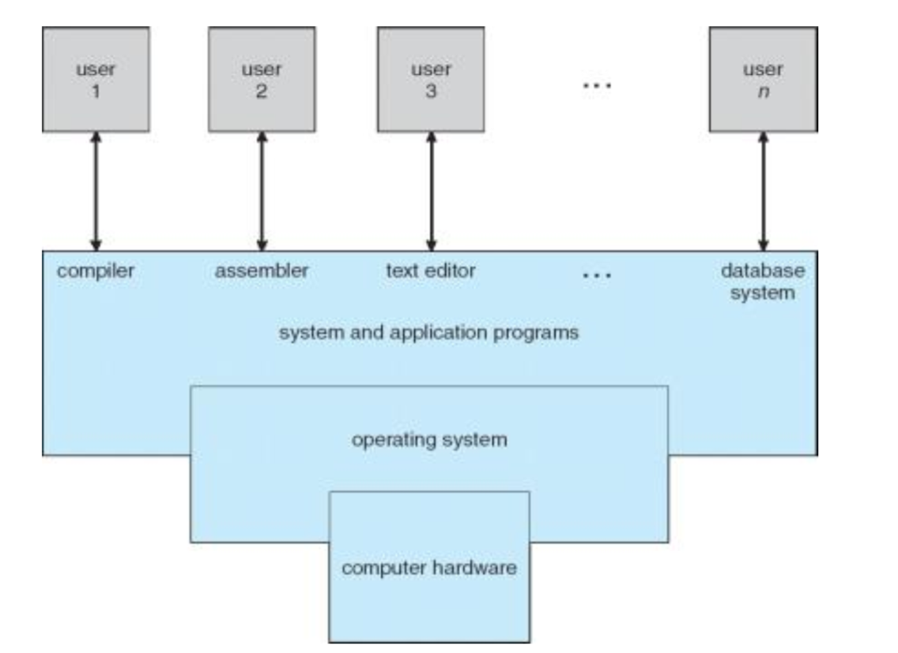
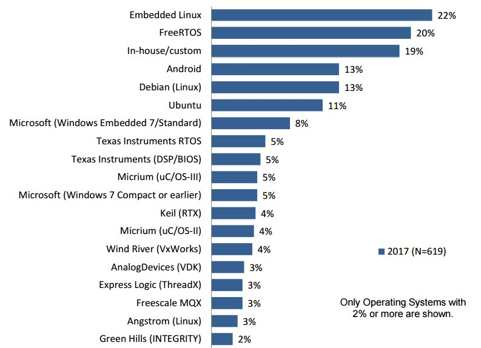

## “从0开始的FreeRTOS”系列教程第一讲

### 作者：satori
大家好，这次给大家带来了Freertos的教程，这次打算一口气做完一整个系列的教程，大概更新频率会是月更

这个系列的教程的主要目的是带大家了解实时系统(real time operating system)的基本概念，熟悉freertos的api使用方法，具备基本的使用rtos进行工程开发的能力

系列计划分几期录完，内容分别为 
* 任务管理
* 队列管理
* 软件定时器管理
* 中断管理
* 资源管理
* 事件组
* 任务通知

本教程的开发环境： 
* 硬件环境
 stm32f103ZET6
* 软件版本
 Keil MDK 5.23
 CubeMX 4.17
* 软件库环境
 HAL库版本1.13.0
 FreeRTOS版本9.0

我们这节课主要解决两个问题：
1. 什么是RTOS？
2. 为什么要用RTOS？

第一个问题： 什么是RTOS（Real time operating system 实时操作系统），在回答这个问题之前，我们先说明白什么是OS（Operating system 操作系统）。

我们正常使用电脑时感觉和使用单片机有很大的差距，在单片机上，我们可以直接调用IO，中断这些硬件功能，但是在电脑时，我们只能够通过一些应用程序与计算机进行交互。

这是因为我们在操作单片机时是在直接和单片机的硬件进行交互，而在使用电脑的时候，实际上我们是和操作系统进行交互，然后操作系统再帮我们完成和硬件交互的过程，用专业一点的方法来说，就是操作系统区分了用户态和内核态，涉及硬件的操作，只能在内核态下由操作系统进行访问，而用户则只能在用户态进行操作。

操作系统本身就像套在硬件外面的一层壳一样，我们用户再在操作系统的外层进行用户应用的开发，用户应用通过操作系统去操作硬件。

而实时操作系统也是操作系统的一种。

实时操作系统相比一般的操作系统会更加强调实时性，相比我们平时使用的操作系统更加注重及时响应用户的输入，实时操作系统的重点是在外界时间或者数据产生时，能够快速接收和处理，处理的结果又能在规定的时间做出响应。

实时操作系统一般用在工业控制，军事设备，航空航天这些对实时性要求强的场景中。

在stm32开发时，我们一般会采取裸机开发的方式，所谓裸机是指我们一般的轮询+中断的工程代码构筑方式，我们能够实现比较复杂的任务的手段主要是通过中断优先级和中断嵌套。而且这些工作的完成是依赖于nvic寄存器，也就是完全以硬件的方式完成的。

但我们也可以通过freertos这样的实时操作系统进行开发，也就是我们创建一些用户进程，由操作系统根据我们之前设定好的需求对进程的运行进行管理，这是一种通过软件对任务进行调度的方式。

当然，我们上面讲的并不是操作系统的全部，实际上操作系统的历史发展和多道程序设计技术密切相关，但这些不是我们这里的重点了

第二个问题，为什么要用rtos： 
使用rtos最大的优势是避免由于不定长中断引发的问题，在传统的裸机开发时，有的时候会因为过长等待一个中断的触发，或者过长时间处理一个中断，导致整个系统发生了混乱乃至于崩溃。

而在rtos中，我们可以通过灵活的调度机制避免这种问题

另外RTOS会给每个任务分配固定的任务栈，并在发生栈溢出时进行处理，避免了由于栈溢出导致系统崩溃的风险

此外使用rtos还有便于实现软件接口等一些优势，比如在移植工程时，如果是裸机开发，我们就要重新配置中断，而如果是rtos，我们直接将用户进程拷贝过来就能使用了，免去了重新进行硬件配置的麻烦

最后，在非常复杂的大工程，以至于完全基于中断进行设计几乎不可能时，使用rtos进行任务调度会是很好的选择

我们这次教程要介绍的FreeRTOS就是RTOS的一种，其他比较常见的还有**uCOSⅡ，eCos，都江堰**等实时操作系统，FreeRTOS正如其名，是一个'free'的rtos，它的源码和文档可以免费从官网上面获取。

选择FreeRTOS作为我们这次教程讲解的对象，一方面是因为可以通过CubeMX很轻松的生成一个包含FreeRTOS的32工程。另一方面，FreeRTOS已经是一个应用范围很广，占有率很高，社区很庞大的实时操作系统了。

在下一期教程里，我会给大家介绍一下freertos的源码结构，用cubemx生成包含freertos的工程的方法，以及工程的组件。

