## “从0开始的FreeRTOS”系列教程第一讲

### 作者：satori
这一期教程中，我们将介绍FreeRTOS源码的内容，如何使用cubemx快速生成一个包含freertos的工程，以及包含freertos的工程的结构。 

https://sourceforge.net/projects/freertos/files/FreeRTOS/ 
在上面的网址中下载FreeRTOS源码之后我们得到一个压缩包 

 

解压之后我们看到如下的文件，其中FreeRTOS文件夹中包含了源码和一些平台上的实例demo，FreeRTOS-Plus下是一些拓展功能的源码和demo，剩下的网页主要是一些介绍性的内容。 
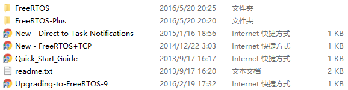 
这里我们主要关注FreeRTOS文件夹下的内容 
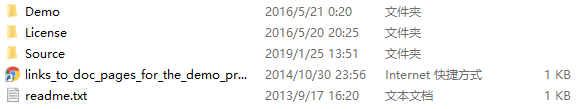 
Demo下包含了大量已经移植好FreeRTOS的示例工程，包含了不同的硬件平台和开发环境。 
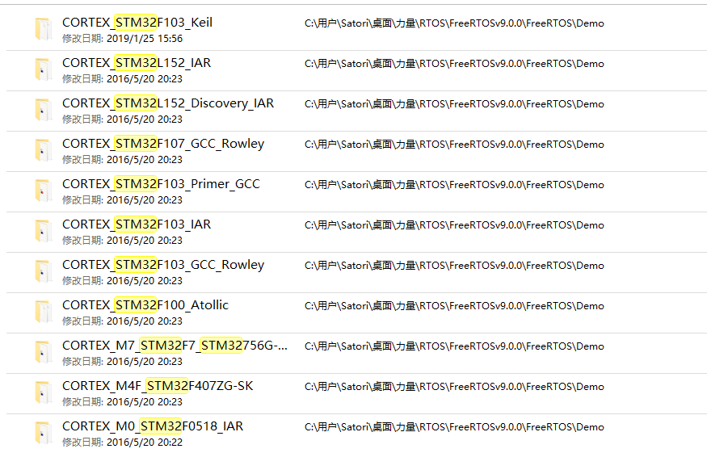 
Source文件夹下是FreeRTOS的源码，在我们使用FreeRTOS进行工程开发时我们需要将源码移植进工程中，只不过如果借助CubeMX生成工程，我们可以免去手动移植的麻烦 
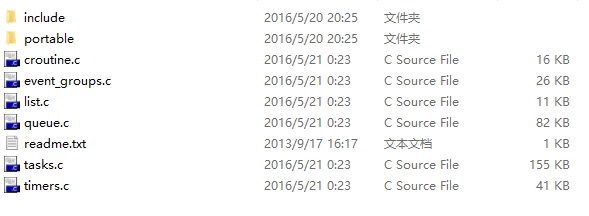 
源码搭建的方式我们不加以介绍，可以参见这篇教程 
http://www.cnblogs.com/yangguang-it/p/6891427.html

下面我们演示如何使用cubemx生成一个包含FreeRTOS的stm32工程，并控制板子上的两盏流水灯以不同的频率闪烁 

cubemx中的配置如下： 
Pinout标签下在侧边栏点开FREERTOS并使能，根据自身情况配置时钟（我在这里打开了RCC），SYS中要将Timebase Source改成TIM1，具体的原因会在下一讲中说明，有兴趣者可以看下面的链接
https://www.cnblogs.com/greenlight-xj/p/9683320.html 
另外使能板子上的两个引脚作为led输出 
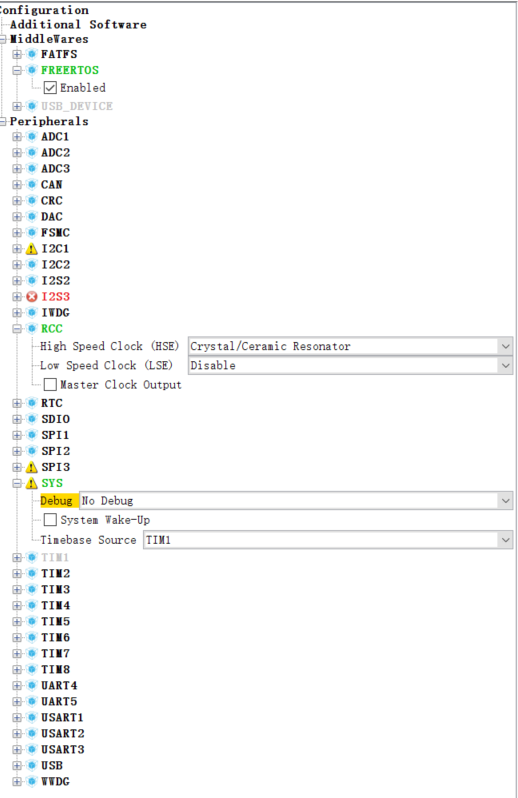 

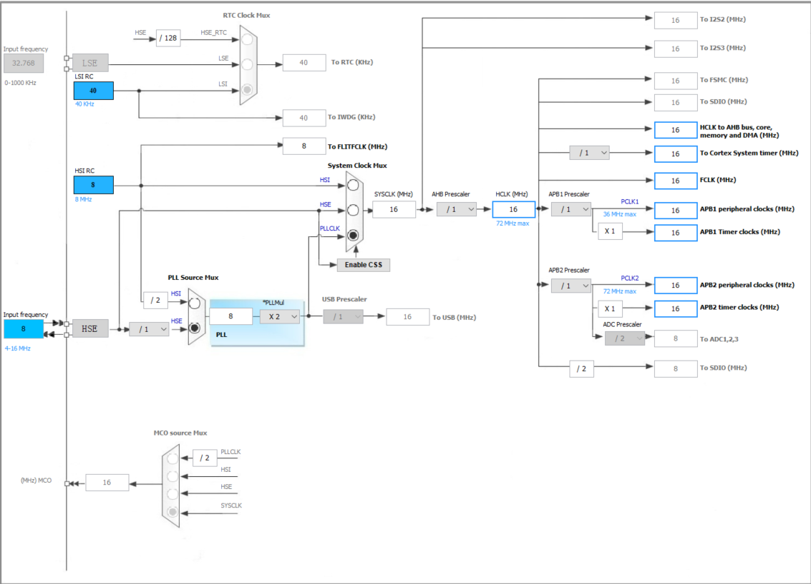 

在configuration标签页下会发现多了一个FreeRTOS，单击打开，点开Tasks and Queues标签页，双击修改系统默认产生的任务，然后点击Add增加第二个任务，修改内容如下所示
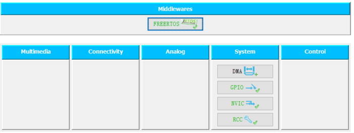 
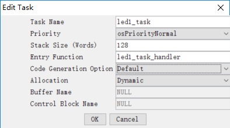 
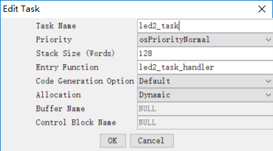 
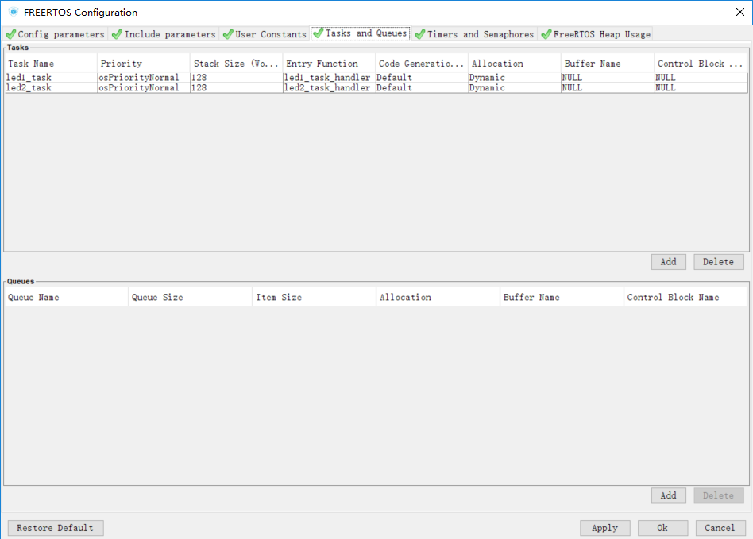 

在Project Setting中打开Code Generator标签页，勾选
 
选项，点击OK 
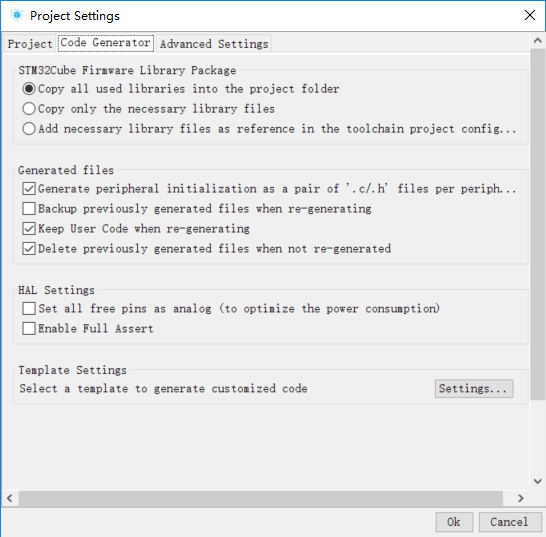 

然后generate code 

打开MDK,工程文件树如下，可以看见FreeRTOS的源码包含在Middlewares/FreeRTOS下 
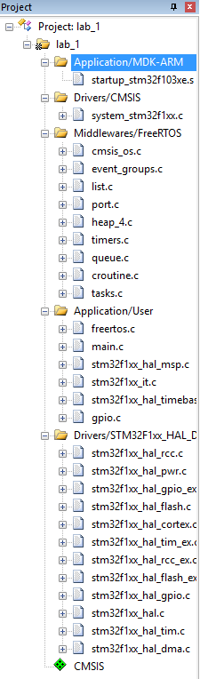 

打开Application/User下的freertos.c，如下修改工程 
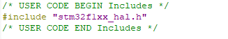 
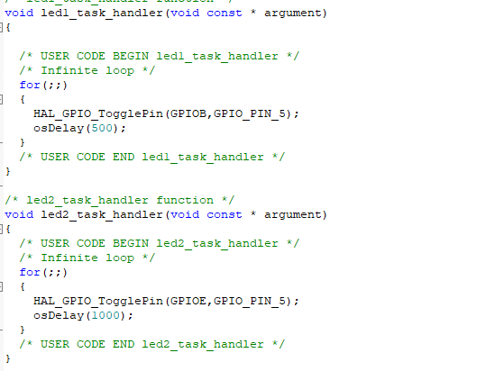 

然后编译，下载，就可以看到两盏led以不同的频率闪烁起来了。并且一个的频率是另一个的两倍。 

最后我们就这个工程来说一下包含FreeRTOS的工程的基本结构
首先我们需要找到一个重要的文件，叫做FreeRTOSConfig.h，它的位置在Inc文件夹下。 
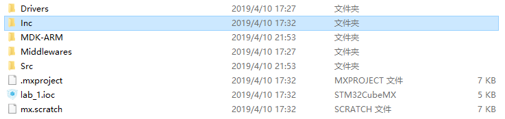 
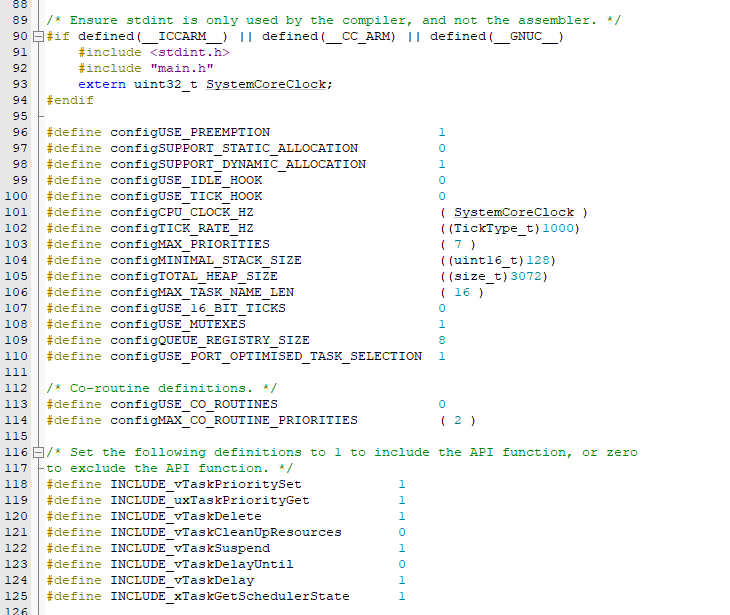 

在这个文件中，可以通过修改宏定义的方式对整个FreeRTOS进行修改，每个宏定义的具体作用我们可以参考官方的文档 
https://www.freertos.org/a00110.html

此外在后续的教程里我们会详细讲述各个宏定义的作用。 

此外在工程里我们会发现出现了诸如osDelay这些我们在FreeRTOS的API中没有发现的函数，这些函数是Keil提供的一套函数接口，称为CMSIS-RTOS。 
https://blog.csdn.net/a389085918/article/details/80016119 

在函数定义里我们会发现实际上它们只是对FreeRTOS的API的简单封装，
有关这一类API我们可以参考 
www.keil.com/pack/doc/CMSIS_Dev/RTOS/html/functionOverview.html
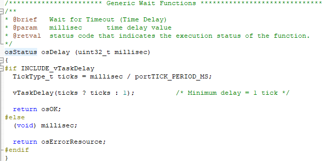 

下一讲我们将介绍FreeRTOS的任务管理。 
