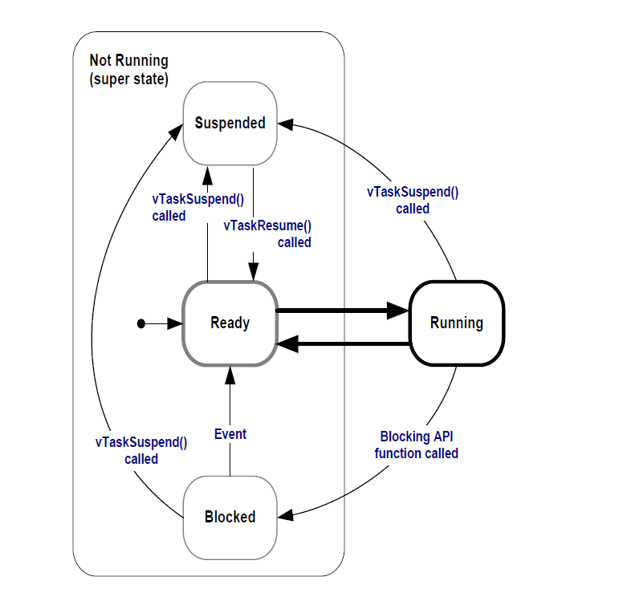
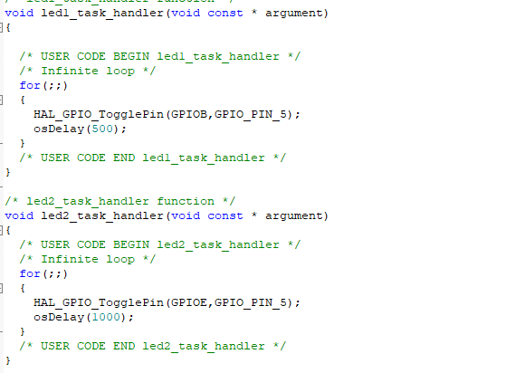
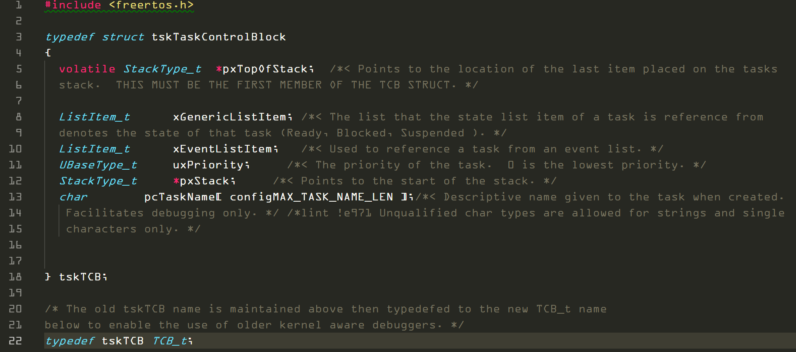
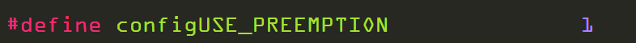
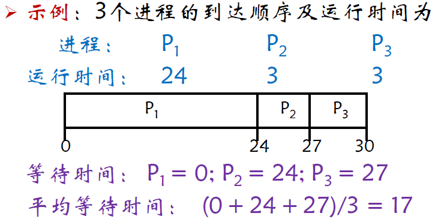
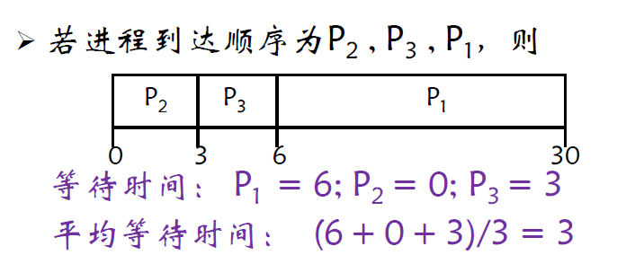
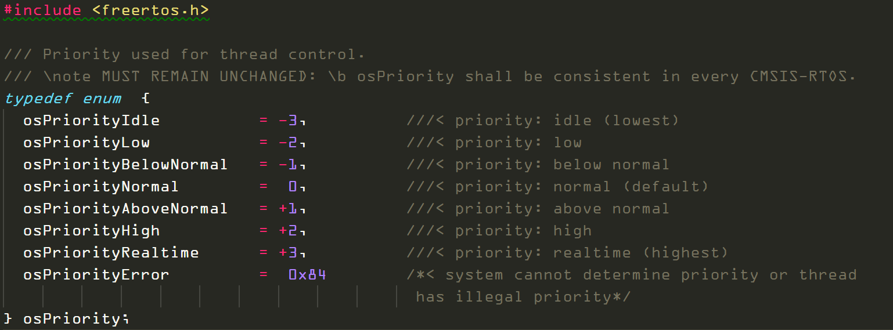
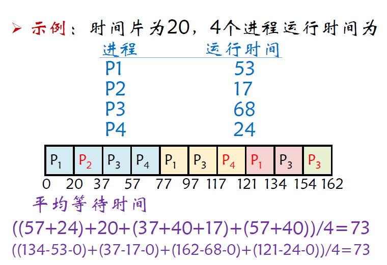
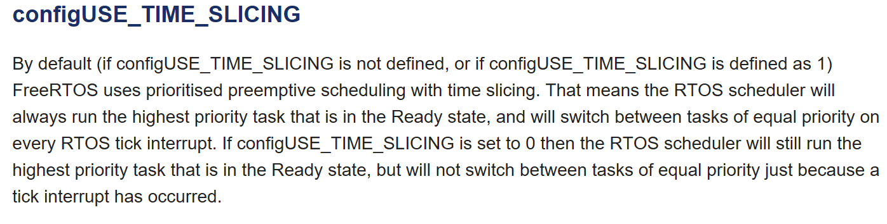
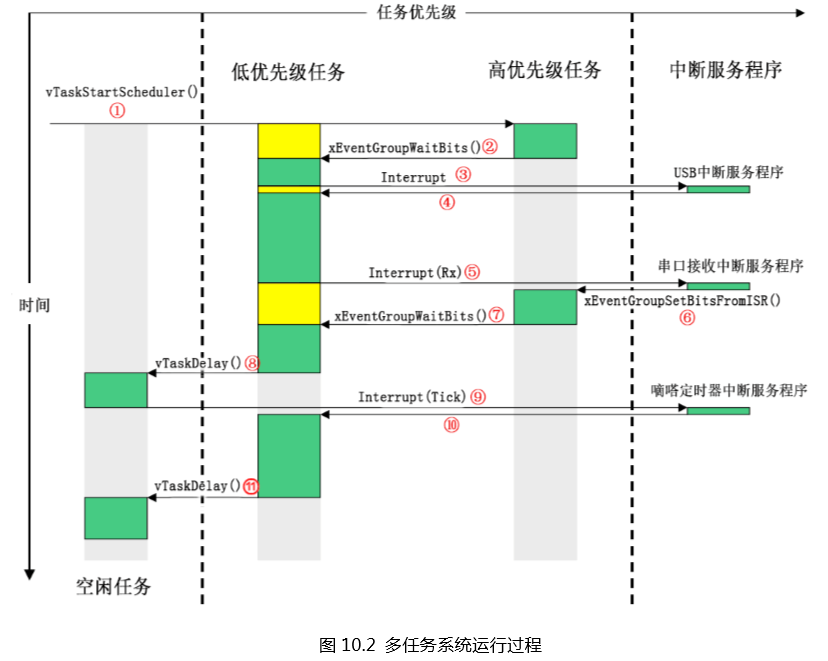

## “从0开始的FreeRTOS”系列教程第一讲

### 作者：satori
这次我们开始介绍FreeRTOS的任务管理机制。 
在第一讲中，我们知道了操作系统是在一个在内存中自动对任务进行调度的硬件和用户的‘中间层’，这一讲中我们来介绍操作系统所作用的对象——**任务**。 
当然，在讲述操作系统原理时我们不会使用任务这种说法，一般被使用的术语是——**进程**。 
我们先简单介绍一下进程的概念，对于进程，我们很难找到一个准确的定义，一般我们会将程序的一次执行当成一个进程，更准确的说，我们将一个程序在一个数据集合上的运行过程当成一个进程，这说明进程包含着动态的概念，一段程序执行时，我们一般划分成三个阶段，*开始执行--->执行中--->执行完成*。这也恰好对应了进程的工作状态：*就绪态--->运行态--->终止态*。 
进程除了以上三种状态，还有一个重要的状态被称位阻塞态，关于阻塞态以及状态之间的转换关系我们将在进程调度的部分详细讲解。 
值得一提的是，在FreeRTOS中，进程的四种基本工作状态是就绪态（*Ready*），运行态（*Running*），阻塞态（*Blocked*）和挂起态（*Suspended*），和常见的操作系统有微小的区别。 
 
在操作系统中，我们将进程作为调度和资源分配的基本单位。也就是说，操作系统真正做的事情，就是在这些用户创建的进程之间来回切换，按照用户的需求进行管理。 
实际的代码中，我们看见的'进程'是这样的 
 
可以发现进程中存在着无限循环执行的部分，这个循环中的内容就是我们需要进程执行的内容，显然我们在运行操作系统时，不可能只让一个进程无限的运行下去，因此这个无限循环一定是会被打断的。 
而何时打断这个无限循环，也就是阻塞这个进程，并切换成另一个进程来执行，就是我们的调度所要解决的基本问题。 
结合我们之前所说的进程的工作状态的概念，实际上调度的主要任务就是将进程从一个工作状态切换到另一个工作状态，比如发送将一个正在运行的进程阻塞，或者唤醒一个阻塞的进程让它开始运行。 
每一个进程都会有一个自己专属的数据区域用来存储进程的基本信息，比如进程的名称，目前的工作状态等，这个数据区域被成为进程控制块（TCB），操作系统在进行进程调度时实际上就是对进程控制块进行操作。 
在freertos中，TCB被称为任务控制块。在freertos的源码task.c中，我们可以找到如下的结构体（为了方便截图删去了宏的部分），可以发现其中就包含了xGenericListItem这样一个成员用来记录进程的工作状态。 
 

关于freertos的内核究竟是通过何种手段来操作进程控制块，继而操作进程，我们就不加以介绍了，有兴趣者可以查看如下资料 
https://wenku.baidu.com/view/3c71c41ead51f01dc281f1da.html

下面我们开始介绍本讲真正的重头戏——调度机制 
我们已经知道了，调度的主要任务是执行任务的工作状态切换，那么调度时我们的操作系统会遵循什么原则呢？ 
首先我们明确这样一件事，一般在使用FreeRTOS时，我们会设置进程为可打断的，这种时候我们称操作系统的调度为剥夺方式（也可称为抢占式）。在FreeRTOSConfig.h中，我们通过这样一个宏定义完成这个设置 
 
如果将1改为0的话，则进程不能被打断，称之为非剥夺式或者合作式调度。
下面我们来重点介绍三种调度算法，分别是——
* 先来先服务（FCFS）调度算法
* 优先级调度算法
* 时间片轮转调度算法。

1. 先来先服务（First Come First Service）算法的机制是系统按照进程的就绪顺序进行调度，在FCFS算法中，进程是不会发生打断的，我们举一个简单的例子，假如进程P1,P2，p3依次就绪，那么最后调度的结果就会是P1-P2-P3。FCFS的优点是简单和公平的调度算法，但是其效率很低，由于进程不能被打断，如果执行时间很长的进程先就绪，进程的平均等待时间就会很大。

 
 

2. 优先级调度算法与FCFS算法不同，优先级调度算法是剥夺式的，其机制是给每一个任务分配优先级，当一个进程在运行时，如果有另一个更高优先级的进程就绪了，则阻塞当前的进程，转而执行更高优先级的进程。这个机制和32的中断嵌套比较相似。 
一般优先级调度算法可以分为静态优先级和动态优先级调度算法，静态优先级算法即一开始给进程分配完优先级之后就不再改变，动态优先级则是在进程运行时还会根据情况对进程的优先级进行改动。 
用Cubemx生成的FreeRTOS默认有七个优先级，这七个优先级定义在了cmsis_os.h中。优先数越大，则系统优先级越高。 
 
如果觉得不够用，在FreeRTOSConfig.h中，我们可以通过更改这个宏定义来更改优先级的总个数 
 

3. 时间片轮转调度算法，为了避免出现一个进程持续过久，导致后面的进程过长时间等待，系统会划分时间片，当一个进程的运行时间超出了时间片长度时，系统会阻塞该进程，下面是一个时间片轮转调度算法的例子 
 
在FreeRTOS中，时间片轮转调度算法应用在同优先级的任务上，可以通过设置FreeRTOSConfig.h中的宏定义为0来关闭时间片轮转调度，否则FreeRTOS会默认采用。 
时间片长度由 configTICK_RATE_HZ 这个宏定义决定， 如果设置为1000则 表示时间片的长度为1/1000 S ，即1ms. 
 
 

介绍完上面的三种调度算法之后，我们就可以总结出FreeRTOS的基本调度方式了，对于FreeRTOS而言，不同优先级的进程之间采用优先级调度算法，对于同优先级的进程之间采用时间片轮转调度算法+FCFS算法。 
最后我们关心一下系统进行调度的时机，综合以上算法，一共有以下几种情况时会发生调度 
1. 当前进程执行时，有更高优先级的进程就绪了，则切换成更高优先级的进程来执行
2. 当前进程执行时长超出了时间片，切换成同优先级的已经就绪的进程来执行
3. 当前进程执行完毕，或在执行过程中进入了挂起态，则切换成已经就绪的同优先级任务

最后需要注意的是，FreeRTOS工程依然是可以响应硬件产生的中断的，如下图所示，硬件产生的中断可以打断任意优先级的进程并执行相应的中断服务程序。但也有特殊的情况，当一个进程工作在临界段中时，外界的中断是会被屏蔽掉的，这部分的内容我们会在中断管理章节进行详述。 

 

最后回答一下第二讲中提到的一个问题，为什么在建立工程时我们会设置Timebase为TIM1而非Systick呢？ 
我们假设将systick设为时基。 
因为在实际进行进程调度，比如时间片轮转调度时，我们需要使用到systick的中断，由于我们需要任意硬件中断可以打断系统进程，我们就必须将systick的中断优先级设置为最低。 
但与此同时，硬件中断在运行时，也需要一个时基来协助中断的进行，因此这个时基就必须比任何一个中断的优先级都要高（也就是这个时基一定是一直在稳定的记时，永远不会被任何中断打断）。 
这样就产生了一个矛盾，systick不可能既是最高优先级又是最低优先级，解决这个矛盾的方法就是使用另一个定时器来代替systick充当时基。 

在这一讲中，我们介绍了FreeRTOS中的任务（进程）的概念，并详细说明了FreeRTOS的调度机制，在下一讲中，我们将通过一个实验来学习FreeRTOS中的有关任务管理的API的使用 ，并加深对FreeRTOS的任务调度机制的理解。 
